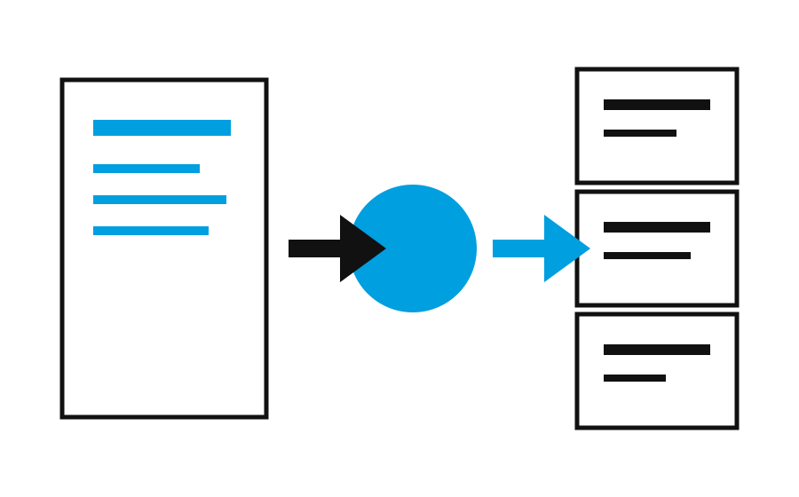

# slidefrom

人間が書いたMarkdownを、内容を変えずにスライドへ組版する。

## 目次

- 基本方針
- 変換の流れ
- テンプレート判定
- Appendix

# 基本方針

## Markdownが正本

文章、数値、コード、リンクの内容と順序を保持する。

## 対応する表現

- 箇条書き
- フロー
- 比較
- 表とグラフ

## 生成の流れ

1. Markdownを解析する
2. 内容の構造を判定する
3. 適したテンプレートを選ぶ
4. HTMLスライドを生成する

## 開発時期

- 8月: Markdown解析
- 9月: テンプレート選択
- 10月: HTML出力

## 方式の比較

### 手書き

- 表現を細かく制御できる
- スライド固有の記法が必要

### slidefrom

- プレーンMarkdownで書ける
- テンプレートを自動で選ぶ

## 対応状況

| 形式 | 状態 | 備考 |
|---|---|---|
| 箇条書き | 対応 | 並列する要点 |
| フロー | 対応 | 順序のある工程 |
| 比較 | 対応 | 2つの小見出し |

## 月別利用数の推移

| 月 | 利用数 |
|---|---:|
| 4月 | 120 |
| 5月 | 180 |
| 6月 | 260 |

## 機能別件数

| 機能 | 件数 |
|---|---:|
| 箇条書き | 12 |
| フロー | 8 |
| 比較 | 5 |

## 出力イメージ



入力内容はそのまま、表現だけを選ぶ。

## 実行例

```sh
slidefrom input.md
```

## 設計原則

内容を書き換えず、表示表現だけを選択する。

> 入力Markdown内のコンテンツノードを追加、削除、並べ替えしない。

# Appendix

## 判定の手がかり

| 入力構造 | 表示形式 |
|---|---|
| 番号付きリスト | フロー |
| 日付付きリスト | タイムライン |
| 数値表 | 表またはグラフ |

# 出典

## 出典一覧

- slidefrom スライドテンプレート仕様
- Markdown入力ファイル
